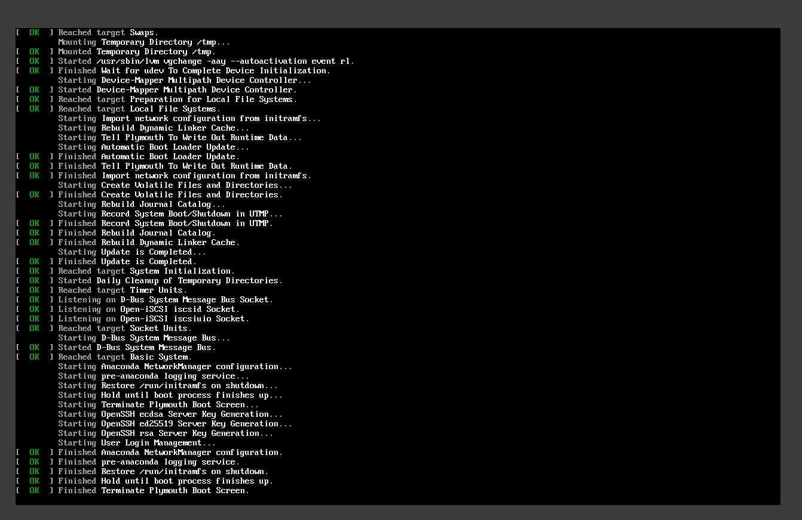
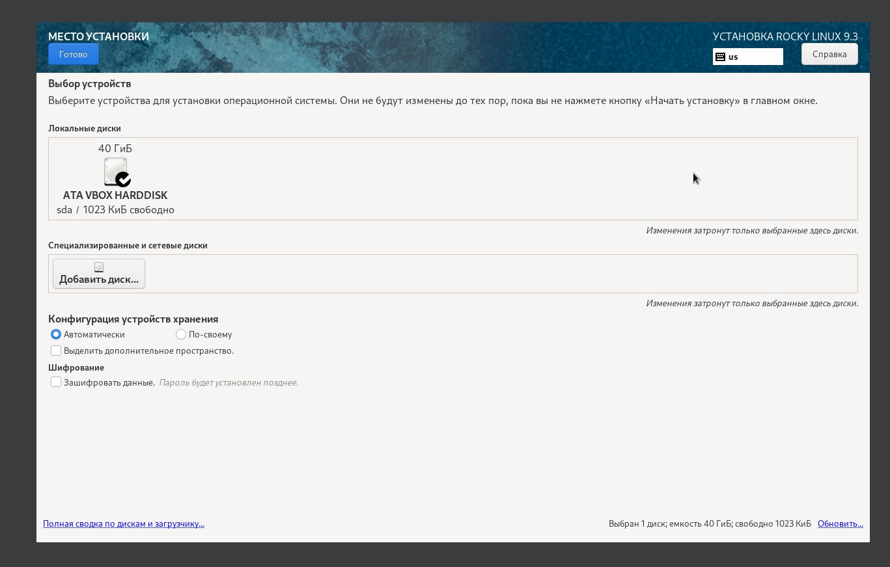
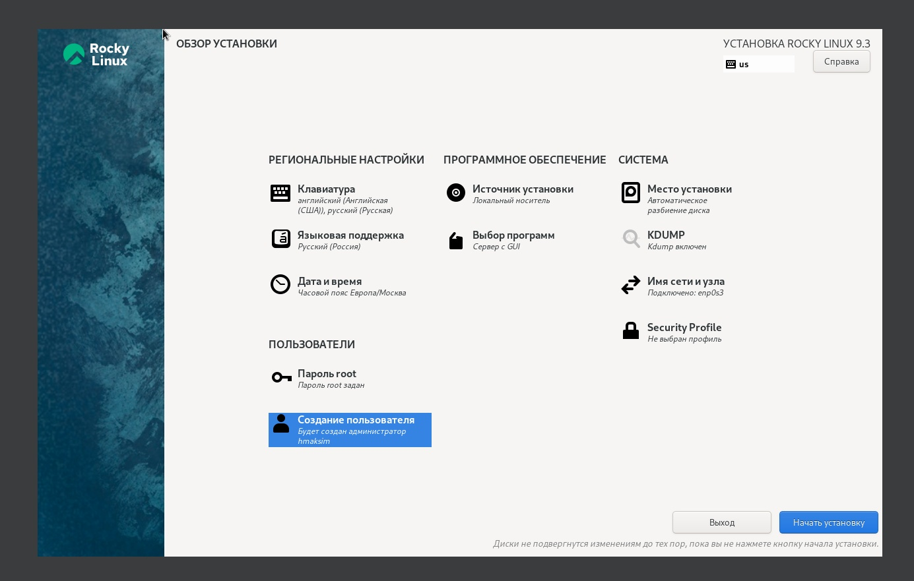
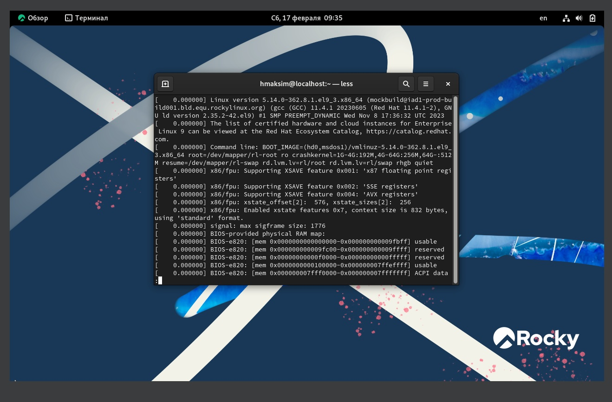
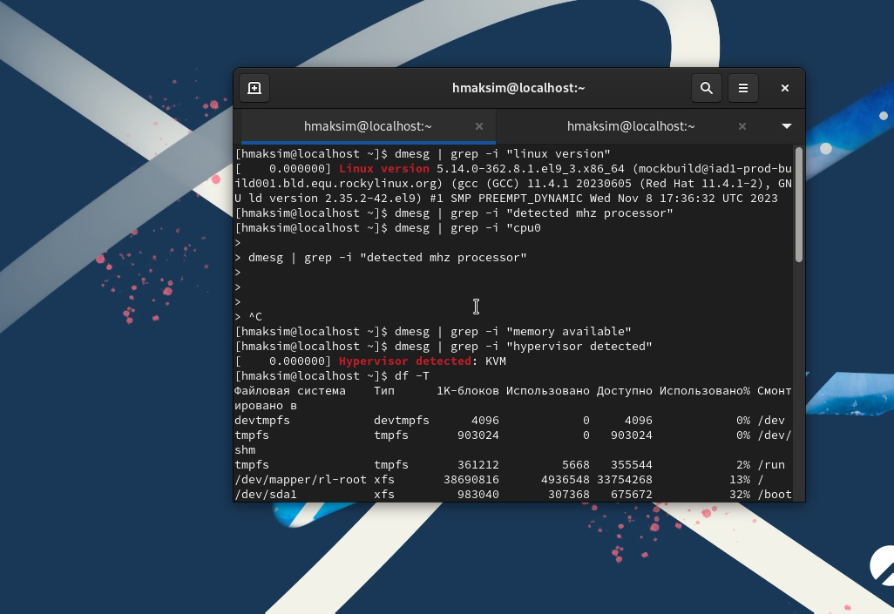
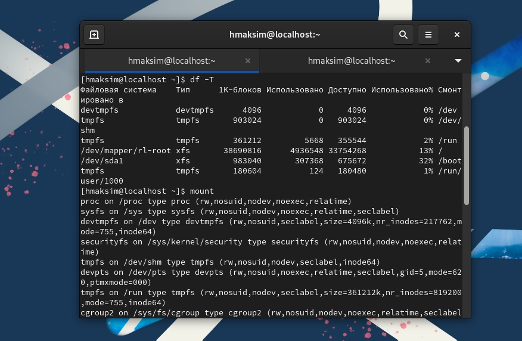
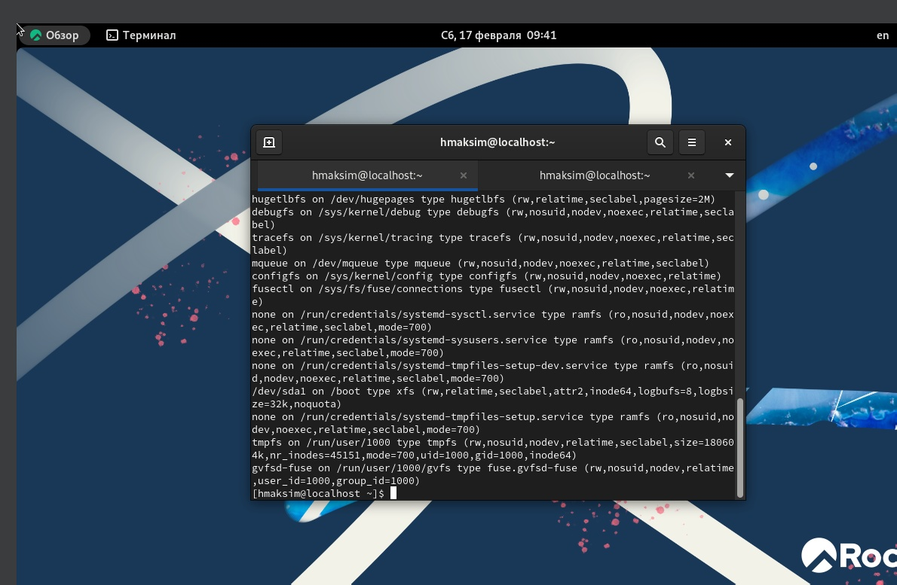

---
## Front matter
title: "Лабораторная работа №1"
subtitle: "Установка и конфигурация операционной системы на виртуальную машину"
author: "Хватов Максим Григорьевич"

## Generic otions
lang: ru-RU
toc-title: "Содержание"

## Bibliography
bibliography: bib/cite.bib
csl: pandoc/csl/gost-r-7-0-5-2008-numeric.csl

## Pdf output format
toc: true # Table of contents
toc-depth: 2
lof: true # List of figures
lot: true # List of tables
fontsize: 12pt
linestretch: 1.5
papersize: a4
documentclass: scrreprt
## I18n polyglossia
polyglossia-lang:
  name: russian
  options:
	- spelling=modern
	- babelshorthands=true
polyglossia-otherlangs:
  name: english
## I18n babel
babel-lang: russian
babel-otherlangs: english
## Fonts
mainfont: PT Serif
romanfont: PT Serif
sansfont: PT Sans
monofont: PT Mono
mainfontoptions: Ligatures=TeX
romanfontoptions: Ligatures=TeX
sansfontoptions: Ligatures=TeX,Scale=MatchLowercase
monofontoptions: Scale=MatchLowercase,Scale=0.9
## Biblatex
biblatex: true
biblio-style: "gost-numeric"
biblatexoptions:
  - parentracker=true
  - backend=biber
  - hyperref=auto
  - language=auto
  - autolang=other*
  - citestyle=gost-numeric
## Pandoc-crossref LaTeX customization
figureTitle: "Рис."
tableTitle: "Таблица"
listingTitle: "Листинг"
lofTitle: "Список иллюстраций"
lotTitle: "Список таблиц"
lolTitle: "Листинги"
## Misc options
indent: true
header-includes:
  - \usepackage{indentfirst}
  - \usepackage{float} # keep figures where there are in the text
  - \floatplacement{figure}{H} # keep figures where there are in the text
---

# Цель работы

Целью данной работы является приобретение практических навыков
установки операционной системы на виртуальную машину, настройки минимально необходимых для дальнейшей работы сервисов.

# Задание

Установить на виртуальную машину систему Rocky Linux и выполнить команды для получения информации:

1. Версия ядра Linux (Linux version).
2. Частота процессора (Detected Mhz processor).
3. Модель процессора (CPU0).
4. Объем доступной оперативной памяти (Memory available).
5. Тип обнаруженного гипервизора (Hypervisor detected).
6. Тип файловой системы корневого раздела.

# Теоретическое введение

Rocky Linux — дистрибутив Linux, разработанный Rocky Enterprise Software Foundation. Предполагается, что это будет полный бинарно-совместимый выпуск, использующий исходный код операционной системы Red Hat Enterprise Linux (RHEL). Цель проекта — предоставить корпоративную операционную систему производственного уровня, поддерживаемую сообществом. Rocky Linux, наряду с Red Hat Enterprise Linux и SUSE Linux Enterprise, стала популярной для использования в корпоративных операционных системах.

Первая версия-кандидат на выпуск Rocky Linux была выпущена 30 апреля 2021 г., а ее первая общедоступная версия была выпущена 21 июня 2021 г. Rocky Linux 8 будет поддерживаться до мая 2029 г.

8 декабря 2020 г. Red Hat объявила о прекращении разработки CentOS, которая была готовой к производству нисходящей версией Red Hat Enterprise Linux , в пользу более нового варианта разработки этой операционной системы, известного как «CentOS Stream».  В ответ первоначальный основатель CentOS Грегори Курцер объявил, что он снова начнет проект для достижения первоначальных целей CentOS.  Его название было выбрано в честь одного из первых соучредителей CentOS Рокки Макгоу. К 12 декабря репозиторий кода Rocky Linux стал самым популярным репозиторием на GitHub.

22 декабря 2020 г. менеджер сообщества Rocky Linux Джордан Писаниелло объявил, что цель релиза первоначального выпуска — где-то между мартом и маем 2021 г.

20 января 2021 г. было объявлено, что тестовый репозиторий будет доступен для общественности к концу февраля, а релиз-кандидат был намечен на конец марта 2021 года. Однако эта дата была немного перенесена, и 30 апреля 2021 года официально вышел первый релиз-кандидат. Второй релиз-кандидат версии 8.4, последний перед стабильным выпуском, был выпущен 4 июня 2021 г. Старший номер версии основан на обозначении RHEL. Rocky Linux — это клон RHEL, который также совместим с двоичными файлами и уже поддерживается многочисленными крупными и финансово сильными спонсорами.  21 июня 2021 года был выпущен стабильный выпуск Rocky Linux 8.4, с кодовым названием «Green Obsidian»[3].

Rocky Linux 9.0 был выпущен 14 июля 2022 года вместе с новой воспроизводимой системой сборки под названием «Peridot», созданной для того, чтобы сообщество могло легко создавать новые форки RHEL, если Rocky Linux когда-либо будет прекращено, и чтобы позволить проекту Rocky Linux делать новые выпуски быстрее. Rocky Linux 9.0 также является первой версией, поддерживающей процессоры PowerPC с прямым порядком байтов и мейнфреймы IBM Z (s390x).

# Выполнение лабораторной работы

Запускаю VirtualBox и конкретно ОС Rocky, чтобы начать его установку.

{#fig:001 width=70%}

Выбираю устройство для установки ОС

{#fig:002 width=70%}

Сделал все необходимые настройки профиля для системы

{#fig:003 width=70%}

Использую различные команды, показанные на следующих скриншотах. Команды нужны для поиска инфрмации о системе в соответствии с заданиями выше.

{#fig:005 width=70%}
{#fig:005 width=70%}
{#fig:005 width=70%}
{#fig:005 width=70%}

# Контрольные вопросы

1. Учётная запись пользователя содержит информацию, такую как:
    - Имя пользователя (логин)
    - Пароль (зашифрованный или хэшированный)
    - Уникальный идентификатор пользователя (UID)
    - Группа пользователя (GID)
    - Домашний каталог пользователя
    - Оболочка командной строки (shell)
    - Привилегии и права доступа
    - Примеры команд терминала:

2. Для получения справки по команде:

man <команда>
или
<команда> --help

Для перемещения по файловой системе:

cd <путь>

Для просмотра содержимого каталога:

ls

Для определения объёма каталога:

du -sh <каталог>

Для создания каталогов / файлов:

mkdir <имя_каталога>
touch <имя_файла>

Для удаления каталогов / файлов:

rm -r <имя_каталога>
rm <имя_файла>

Для задания определённых прав на файл / каталог:

chmod <права> <имя_файла>

Для просмотра истории команд:

history

3. Файловая система - это способ организации и хранения файлов на компьютере. Она определяет структуру файлов и каталогов, а также правила доступа к ним. Примеры файловых систем:

FAT32: Простая файловая система, используемая на съемных носителях, ограниченная в размере файлов и разделов.
NTFS: Система файлов Windows, обладающая расширенными функциями безопасности и поддержкой больших файлов и разделов.
ext4: Один из основных типов файловых систем в Linux, предоставляющий высокую производительность и надежность.
APFS: Файловая система, используемая в macOS, предоставляющая функции шифрования, сжатия и снимков.

4. Чтобы посмотреть, какие файловые системы подмонтированы в ОС, можно воспользоваться командой:

df -Th

5. Чтобы удалить зависший процесс, можно воспользоваться командой kill. Сначала нужно найти идентификатор процесса (PID) с помощью команды ps aux | grep <название_процесса>, а затем выполнить команду kill <PID>. Например:

ps aux | grep firefox
kill 1234

# Выводы

Я научился устанавливать систему на виртуальную машину и настраивать сервисы, необходимые для ее работы.

