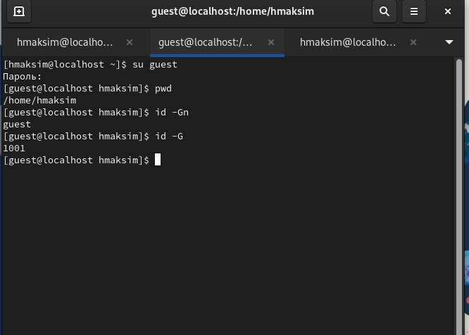

---
## Front matter
title: "Лабораторная работа №2"
subtitle: "Дискреционное разграничение прав в Linux. Основные атрибуты"
author: "Хватов Максим Григорьевич"

## Generic otions
lang: ru-RU
toc-title: "Содержание"

## Bibliography
bibliography: bib/cite.bib
csl: pandoc/csl/gost-r-7-0-5-2008-numeric.csl

## Pdf output format
toc: true # Table of contents
toc-depth: 2
lof: true # List of figures
lot: true # List of tables
fontsize: 12pt
linestretch: 1.5
papersize: a4
documentclass: scrreprt
## I18n polyglossia
polyglossia-lang:
  name: russian
  options:
	- spelling=modern
	- babelshorthands=true
polyglossia-otherlangs:
  name: english
## I18n babel
babel-lang: russian
babel-otherlangs: english
## Fonts
mainfont: PT Serif
romanfont: PT Serif
sansfont: PT Sans
monofont: PT Mono
mainfontoptions: Ligatures=TeX
romanfontoptions: Ligatures=TeX
sansfontoptions: Ligatures=TeX,Scale=MatchLowercase
monofontoptions: Scale=MatchLowercase,Scale=0.9
## Biblatex
biblatex: true
biblio-style: "gost-numeric"
biblatexoptions:
  - parentracker=true
  - backend=biber
  - hyperref=auto
  - language=auto
  - autolang=other*
  - citestyle=gost-numeric
## Pandoc-crossref LaTeX customization
figureTitle: "Рис."
tableTitle: "Таблица"
listingTitle: "Листинг"
lofTitle: "Список иллюстраций"
lotTitle: "Список таблиц"
lolTitle: "Листинги"
## Misc options
indent: true
header-includes:
  - \usepackage{indentfirst}
  - \usepackage{float} # keep figures where there are in the text
  - \floatplacement{figure}{H} # keep figures where there are in the text
---

# Цель работы

Получение практических навыков работы в консоли с атрибутами файлов для групп пользователей.


# Выполнение лабораторной работы

В установленной операционной системе создаю учётную запись пользователя guest (использую учётную запись администратора):
useradd guest
Задаю пароль для пользователя guest (использую учётную запись администратора):
passwd guest. 
Аналогично создаю пользователя guest2 той же командой и добавляю его в группу guest командой 
gpasswd -a guest2 guest.

{#fig:001 width=70%}

Осуществляю вход с систему через пользователя guest и guest2 в двух консолях командой su guest, su guest2. Вход через su guest2 осуществить неполучается: почему-то не принимает пароль.

Уточняю имя пользователя, его группу, кто входит в неё
и к каким группам принадлежит он сам. Определяю командами
groups guest и groups guest2, в какие группы входят пользователи guest и guest2. Сравниваю вывод команды groups с выводом команд
id -Gn и id -G. 

В первом случае имя группы, а во втором id.

{#fig:002 width=70%}

{#fig:003 width=70%}

Просматриваю файл /etc/group командой ```cat /etc/passwd```

{#fig:004 width=70%}

От имени пользователя guest изменяю права директории /home/guest,
разрешив все действия для пользователей группы:
chmod g+rwx /home/guest

{#fig:005 width=70%}

От имени пользователя guest снимаю с директории /home/guest/dir1
все атрибуты командой
chmod 000 dirl

{#fig:006 width=70%}


|Операция|Минимальные права на директорию|Минимальные права на файл|
|-|--------|---|
|Создание файла|drwx|rwx|
|Удаление файла|drwx |rwx|
|Чтение файла| drwx|rwx|
|Запись в файл| drwx|rwx|
|Переименование файла|drwx|rwx|
|Создание поддиректории|d--x|drwx|


# Вывод

Я получил практические навыки работы в консоли с атрибутами файлов для групп пользователей.