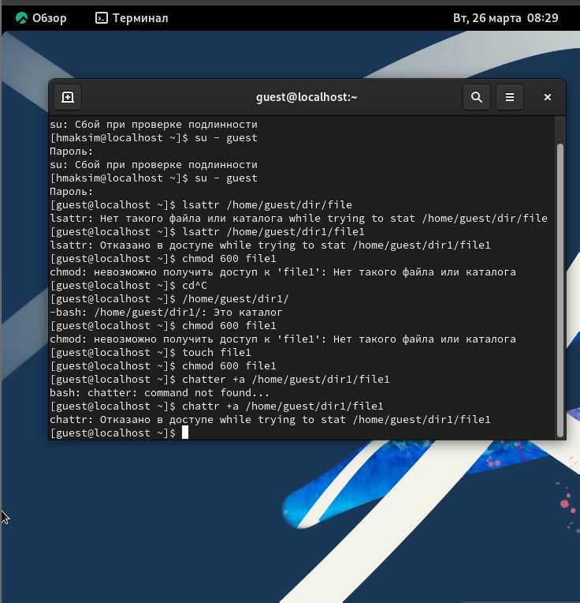
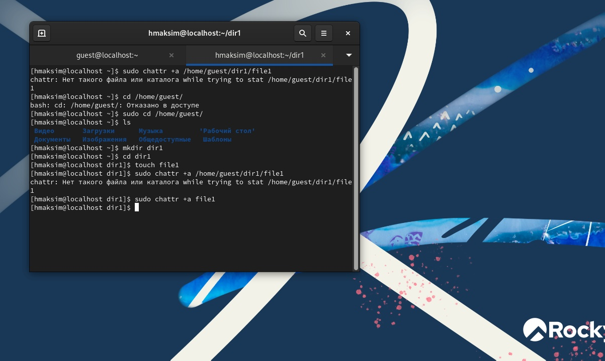
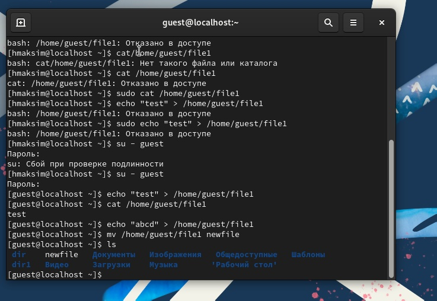
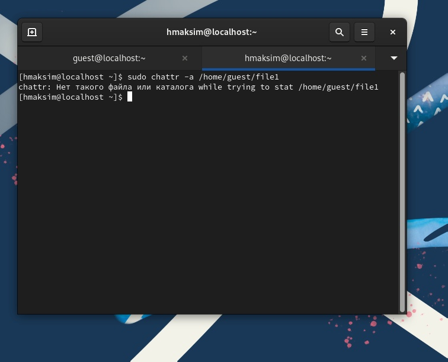

---
## Front matter
title: "Лабораторная работа №4"
subtitle: "Дискреционное разграничение прав в Linux. Расширенные атрибуты"
author: "Хватов Максим Григорьевич"

## Generic otions
lang: ru-RU
toc-title: "Содержание"

## Bibliography
bibliography: bib/cite.bib
csl: pandoc/csl/gost-r-7-0-5-2008-numeric.csl

## Pdf output format
toc: true # Table of contents
toc-depth: 2
lof: true # List of figures
lot: true # List of tables
fontsize: 12pt
linestretch: 1.5
papersize: a4
documentclass: scrreprt
## I18n polyglossia
polyglossia-lang:
  name: russian
  options:
	- spelling=modern
	- babelshorthands=true
polyglossia-otherlangs:
  name: english
## I18n babel
babel-lang: russian
babel-otherlangs: english
## Fonts
mainfont: PT Serif
romanfont: PT Serif
sansfont: PT Sans
monofont: PT Mono
mainfontoptions: Ligatures=TeX
romanfontoptions: Ligatures=TeX
sansfontoptions: Ligatures=TeX,Scale=MatchLowercase
monofontoptions: Scale=MatchLowercase,Scale=0.9
## Biblatex
biblatex: true
biblio-style: "gost-numeric"
biblatexoptions:
  - parentracker=true
  - backend=biber
  - hyperref=auto
  - language=auto
  - autolang=other*
  - citestyle=gost-numeric
## Pandoc-crossref LaTeX customization
figureTitle: "Рис."
tableTitle: "Таблица"
listingTitle: "Листинг"
lofTitle: "Список иллюстраций"
lotTitle: "Список таблиц"
lolTitle: "Листинги"
## Misc options
indent: true
header-includes:
  - \usepackage{indentfirst}
  - \usepackage{float} # keep figures where there are in the text
  - \floatplacement{figure}{H} # keep figures where there are in the text
---

# Цель работы

Получение практических навыков работы в консоли с расширенными атрибутами файлов

# Выполнение лабораторной работы

Захожу в консоль от имени пользователя guest с помощью оманды su - guest

От его имени определяю расширенные атрибуты файла /home/guest/dir1/file1 с помощью команды lsattr /home/guest/dir1/file1

Устанавливаю командой chmod 600 file1 права разрешающий чтение и запись для владельца файла

Устанавливаю расширенный атрибут a от имени пользователя guest и получаю отказ в доступе. При этом исползовал команду chattr +a /home/guest/dir1/file1

{#fig:001 width=70%}

Захожу во вторую консоль с правами администратора и пробую снова установить расширенный атрибут командой chattr +a /home/guest/dir1/file1

{#fig:002 width=70%}

Проверяю правильность атрибута lsattr /home/guest/dir1/file1 и получаю ---a---------
Выполняю дозапись в file1 слово "test" с помощью команды  echo "test" > /home/guest/dir1/file1
После этого выполняю чтение файла file1 с помощью команды cat /home/guest/dir1/file1. Слово test успешно выведено в консоль.
Перезаписываю информацию в файле file1 с помощью команды echo "abcd" > /home/guest/dirl/file1. Слово test заменяется здесь на abcd. Переименовываю файл file1 в newfile с помощью команды mv ...../file1 newfile.проверяю, что все преименовано командой ls.

{#fig:003 width=70%}

Пробую установить на file1 некоторые права, в резуьтате чего получаю ошибку, т.к. такого файла уже нет, ведь он переименован в newfile. Снять расширенный атрибудт также не выходит, потмоу что файла не существует.

{#fig:004 width=70%}

# Вывод

Я получил практические навыки работы в консоли с расширенными атрибутами файлов
