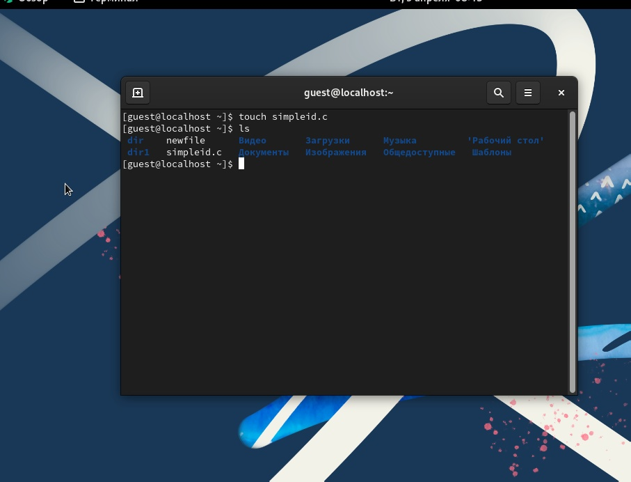

---
## Front matter
title: "Лабораторная работа №5"
subtitle: "Дискреционное разграничение прав в Linux. Исследование влияния дополнительных атрибутов"
author: "Хватов Максим"

## Generic otions
lang: ru-RU
toc-title: "Содержание"

## Bibliography
bibliography: bib/cite.bib
csl: pandoc/csl/gost-r-7-0-5-2008-numeric.csl

## Pdf output format
toc: true # Table of contents
toc-depth: 2
lof: true # List of figures
lot: true # List of tables
fontsize: 12pt
linestretch: 1.5
papersize: a4
documentclass: scrreprt
## I18n polyglossia
polyglossia-lang:
  name: russian
  options:
	- spelling=modern
	- babelshorthands=true
polyglossia-otherlangs:
  name: english
## I18n babel
babel-lang: russian
babel-otherlangs: english
## Fonts
mainfont: PT Serif
romanfont: PT Serif
sansfont: PT Sans
monofont: PT Mono
mainfontoptions: Ligatures=TeX
romanfontoptions: Ligatures=TeX
sansfontoptions: Ligatures=TeX,Scale=MatchLowercase
monofontoptions: Scale=MatchLowercase,Scale=0.9
## Biblatex
biblatex: true
biblio-style: "gost-numeric"
biblatexoptions:
  - parentracker=true
  - backend=biber
  - hyperref=auto
  - language=auto
  - autolang=other*
  - citestyle=gost-numeric
## Pandoc-crossref LaTeX customization
figureTitle: "Рис."
tableTitle: "Таблица"
listingTitle: "Листинг"
lofTitle: "Список иллюстраций"
lotTitle: "Список таблиц"
lolTitle: "Листинги"
## Misc options
indent: true
header-includes:
  - \usepackage{indentfirst}
  - \usepackage{float} # keep figures where there are in the text
  - \floatplacement{figure}{H} # keep figures where there are in the text
---

# Цель работы

Изучение механизмов изменения идентификаторов, применения SetUID- и Sticky-битов. Получение практических навыков работы в консоли с дополнительными атрибутами. Рассмотрение работы механизма смены идентификатора процессов пользователей, а также влияние бита Sticky на запись и удаление файлов.

#  Подготовка лабораторного стенда

Помимо прав администратора для выполнения части заданий потребуются средства разработки приложений. В частности, при подготовке стенда
следует убедиться, что в системе установлен компилятор gcc (для этого, например, можно ввести команду gcc -v). Если же gcc не установлен, то его
необходимо установить, например, командой
yum install gcc
которая определит зависимости и установит следующие пакеты: gcc, cloogppl, срр, glibc-devel, glibc-headers, kernel-headers, libgomp, ppl, cloog-ppl,
срр, gcc, glibc-devel, glibc-headers, kernel-headers, libgomp, libstdc++-devel,
mpfr, ppl, glibc, glibc-common, libgcc, libstdc++.
Файловая система, где располагаются домашние директории и файлы
пользователей (в частности, пользователя guest), не должна быть смонтирована с опцией nosuid.
Так как программы с установленным битом SetUID могут представлять
большую брешь в системе безопасности, в современных системах используются дополнительные механизмы защиты. Проследите, чтобы система
защиты SELinux не мешала выполнению заданий работы. Если вы не знаете, что это такое, просто отключите систему запретов до очередной перезагрузки системы командой
setenforce 0

После этого команда getenforce должна выводить Permissive. В этой
работе система SELinux рассматриваться не будет.


# Компилирование программ

Для выполнения четвёртой части задания вам потребуются навыки программирования, а именно, умение компилировать простые программы, написанные на языке С (С++), используя интерфейс CLI.
Само по себе создание программ не относится к теме, по которой выполняется работа, а является вспомогательной частью, позволяющей увидеть, как реализуются на практике те или иные механизмы дискреционного
разграничения доступа. Если при написании (или исправлении существующих) скриптов на bash-e у большинства системных администраторов не
возникает проблем, то процесс компилирования, как показывает практика,
вызывает необоснованные затруднения.
Компиляторы, доступные в Linux-системах, являются частью коллекции GNU-компиляторов, известной как GCC (GNU Compiller Collection,
подробнее см. http://gcc.gnu.org). В неё входят компиляторы языков
С, С++, Java, Objective-C, Fortran и Chill. Будем использовать лишь первые
два.
Компилятор языка С называется gcc. Компилятор языка С++ называется
g++ и запускается с параметрами почти так же, как gcc.
Проверить это можно следующими командами:
whereis gcc
whereis g++
Первый шаг заключается в превращении исходных файлов в объектный
код:
gcc -c file.с
В случае успешного выполнения команды (отсутствие ошибок в коде)
полученный объектный файл будет называться file.о.
Объектные файлы невозможно запускать и использовать, поэтому после
компиляции для получения готовой программы объектные файлы необходимо скомпоновать. Компоновать можно один или несколько файлов. В случае использования хотя бы одного из файлов, написанных на С++, компоновка производится с помощью компилятора g++. Строго говоря, это тоже
не вполне верно. Компоновка объектного кода, сгенерированного чем бы то
ни было (хоть вручную), производится линкером ld, g++ его просто вызывает изнутри. Если же все файлы написаны на языке С, нужно использовать
компилятор gcc.
Например, так:
gcc -o program file.o
В случае успешного выполнения команды будет создана программа
program (исполняемый файл формата ELF с установленным атрибутом +х).
Компилирование — это процесс. Компилятор gcc (g++) имеет множество параметров, влияющих на процесс компиляции. Он поддерживает различные режимы оптимизации, выбор платформы назначения и пр.
Также возможно использование make-файлов (Makefile) с помощью
утилиты make для упрощения процесса компиляции.

Такое решение подойдёт лишь для простых случаев. Если говорить про
пример выше, то компилирование одного файла из двух шагов можно сократить вообще до одного, например:
gcc file.c
В этом случае готовая программа будет иметь называние a.out.
Механизм компилирования программ в данной работе не мог быть не
рассмотрен потому, что использование программ, написанных на bash, для
изучения SetUID- и SetGID- битов, не представляется возможным. Связано
это с тем, что любая bash-программа интерпретируется в процессе своего
выполнения, т.е. существует сторонняя программа-интерпретатор, которая
выполняет считывание файла сценария и выполняет его последовательно.
Сам интерпретатор выполняется с правами пользователя, его запустившего,
а значит, и выполняемая программа использует эти права.
При этом интерпретатору абсолютно всё равно, установлены SetUID-,
SetGID-биты у текстового файла сценария, атрибут разрешения запуска «x»
или нет. Важно, чтобы был установлен лишь атрибут, разрешающий чтение
«r».
Также не важно, был ли вызван интерпретатор из командной строки
(запуск файла, как bash file1.sh), либо внутри файла была указана строчка
#!/bin/bash.
Логично спросить: если установление SetUID- и SetGID- битов на сценарий не приводит к нужному результату как с исполняемыми файлами,
то что мешает установить эти биты на сам интерпретатор? Ничего не мешает, только их установление приведёт к тому, что, так как владельцем
/bin/bash является root:
ls -l /bin/bash
все сценарии, выполняемые с использованием /bin/bash, будут иметь возможности суперпользователя — совсем не тот результат, который хотелось
бы видеть.
Если сомневаетесь в выше сказанном, создайте простой файл progl.sh
следующего содержания:
#!/bin/bash
/usr/bin/id /usr/bin/whoami
и попробуйте поменять его атрибуты в различных конфигурациях.
Подход вида: сделать копию /bin/bash, для нее chown user:users и
потом SUID также плох, потому что это позволит запускать любые команды
от пользователя user

# Выполнение работы

Захожу в систему от имени пользователя guest и создаю файл simpleid.c с помощью команды touch

{#fig:001 width=70%}

Затем пишу код в этом файле

```
#include <sys/types.h>
#include <unistd.h>
#include <stdio.h>
int
main ()
{
uid_t uid = geteuid ();
gid_t gid = getegid ();
printf ("uid=%d, gid=%d\n", uid, gid);
return 0;
}


```

{#fig:002 width=70%}

Компилирую программу с помощью gcc и команды gcc simpleid.c -o simpleid


{#fig:003 width=70%}

После этого запускаю полученный исполняемый файл с помощью команды ./simpleid и ыполняю затем команду id.

Результат на рисунке 3. Значения, выдаваемые программой и системной командой одинаковые.

Усложняю программу, создав новвый файл simpleid.c. Вписываю код

```
#include <sys/types.h>
#include <unistd.h>
#include <stdio.h>
int
main ()
{
uid_t real_uid = getuid ();
uid_t e_uid = geteuid ();
gid_t real_gid = getgid ();
gid_t e_gid = getegid () ;
printf ("e_uid=%d, e_gid=%d\n", e_uid, e_gid);
printf ("real_uid=%d, real_gid=%d\n", real_uid,
,→ real_gid);
return 0;
}

```

{#fig:004 width=70%}

Компилирую с помощью команды gcc simpleid2.c -o simpleid2, получаю исполняемый файл и запускаю его командой ./simpleid2

Создаю файл readfile.c с поомщью команды touch

```
#include <fcntl.h>
#include <stdio.h>
#include <sys/stat.h>
#include <sys/types.h>
#include <unistd.h>
int
main (int argc, char* argv[])
{
unsigned char buffer[16];
size_t bytes_read;
int i;
int fd = open (argv[1], O_RDONLY);
do
{
bytes_read = read (fd, buffer, sizeof (buffer));
for (i =0; i < bytes_read; ++i) printf("%c", buffer[i]);
}
while (bytes_read == sizeof (buffer));
close (fd);
return 0;
}

```

Компилирую файл командой gcc readfile.c -o readfile

Выполняю команду ls -l / | grep tmp и выясняю, что атрибут установлен.
От имени пользователя guest создаю файл и ввожу в него текст командой echo "test" > /tmp/file01.txt

Просматриваю атрибуты и разрешаю чтение и запись для категории пользователей "все остальное", выполняя команды

ls -l /tmp/file01.txt
chmod o+rw /tmp/file01.txt
ls -l /tmp/file01.txt

Проверяю содержимое файла командой cat /tmp/file01.txt

{#fig:004 width=70%}


# Вывод

 Я изучил механизмы изменения идентификаторов, применения SetUID- и Sticky-битов. Получил практические навыки работы в консоли с дополнительными атрибутами. Рассмотрел работы механизма смены идентификатора процессов пользователей, а также влияние бита Sticky на запись и удаление файлов.

