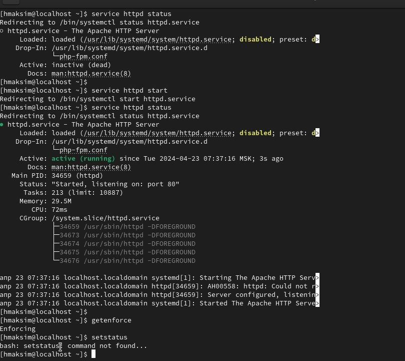
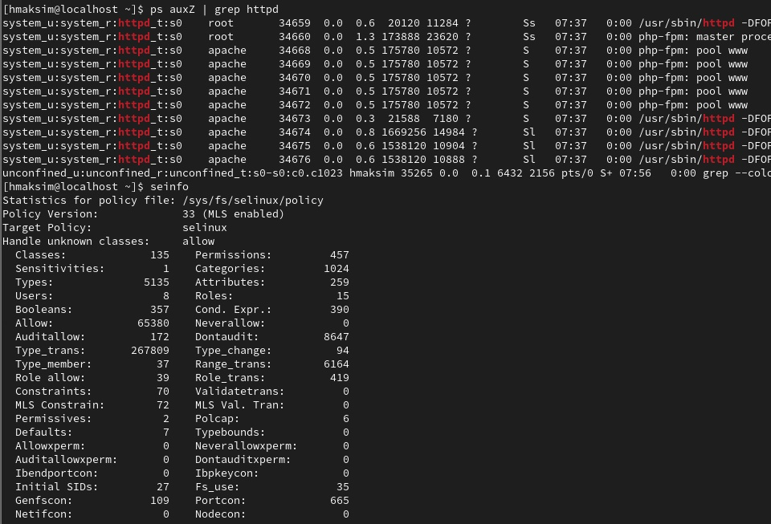
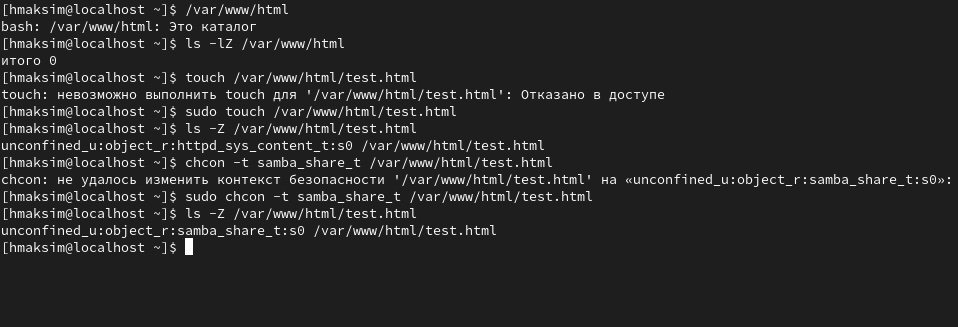

---
## Front matter
title: "Лабораторная работа №6"
subtitle: "Мандатное разграничение прав в Linux"
author: "Джахангиров Илгар"

## Generic otions
lang: ru-RU
toc-title: "Содержание"

## Bibliography
bibliography: bib/cite.bib
csl: pandoc/csl/gost-r-7-0-5-2008-numeric.csl

## Pdf output format
toc: true # Table of contents
toc-depth: 2
lof: true # List of figures
lot: true # List of tables
fontsize: 12pt
linestretch: 1.5
papersize: a4
documentclass: scrreprt
## I18n polyglossia
polyglossia-lang:
  name: russian
  options:
	- spelling=modern
	- babelshorthands=true
polyglossia-otherlangs:
  name: english
## I18n babel
babel-lang: russian
babel-otherlangs: english
## Fonts
mainfont: PT Serif
romanfont: PT Serif
sansfont: PT Sans
monofont: PT Mono
mainfontoptions: Ligatures=TeX
romanfontoptions: Ligatures=TeX
sansfontoptions: Ligatures=TeX,Scale=MatchLowercase
monofontoptions: Scale=MatchLowercase,Scale=0.9
## Biblatex
biblatex: true
biblio-style: "gost-numeric"
biblatexoptions:
  - parentracker=true
  - backend=biber
  - hyperref=auto
  - language=auto
  - autolang=other*
  - citestyle=gost-numeric
## Pandoc-crossref LaTeX customization
figureTitle: "Рис."
tableTitle: "Таблица"
listingTitle: "Листинг"
lofTitle: "Список иллюстраций"
lotTitle: "Список таблиц"
lolTitle: "Листинги"
## Misc options
indent: true
header-includes:
  - \usepackage{indentfirst}
  - \usepackage{float} # keep figures where there are in the text
  - \floatplacement{figure}{H} # keep figures where there are in the text
---

# Цель работы

Развить навыки администрирования ОС Linux. Получить первое практическое знакомство с технологией SELinux.
Проверить работу SELinx на практике совместно с веб-сервером
Apache.


#  Подготовка лабораторного стенда

1. При подготовке стенда обратите внимание, что необходимая для работы и указанная выше политика targeted и режим enforcing используются в данном дистрибутиве по умолчанию, т.е. каких-то специальных настроек не требуется. При этом следует убедиться, что политика и режим
включены, особенно когда работа будет проводиться повторно и велика
вероятность изменений при предыдущем использовании системы.
2. При необходимости администратор должен разбираться в работе SELinux и уметь как исправить конфигурационный файл
/etc/selinux/config, так и проверить используемый режим и
политику.
3. Необходимо, чтобы был установлен веб-сервер Apache. При установке
системы в конфигурации «рабочая станция» указанный пакет не ставится.
4. В конфигурационном файле /etc/httpd/httpd.conf необходимо задать параметр ServerName:
ServerName test.ru
чтобы при запуске веб-сервера не выдавались лишние сообщения об
ошибках, не относящихся к лабораторной работе.
5. Также необходимо проследить, чтобы пакетный фильтр был отключён
или в своей рабочей конфигурации позволял подключаться к 80-у и 81-у
портам протокола tcp.
Отключить фильтр можно командами
iptables -F
iptables -P INPUT ACCEPT iptables -P OUTPUT ACCEPT
либо добавить разрешающие правила:
iptables -I INPUT -p tcp --dport 80 -j ACCEPT
iptables -I INPUT -p tcp --dport 81 -j ACCEPT
iptables -I OUTPUT -p tcp --sport 80 -j ACCEPT
iptables -I OUTPUT -p tcp --sport 81 -j ACCEPT
6. Обратите внимание, что данные правила не являются «точными» и рекомендуемыми на все случаи жизни, они лишь позволяют правильно организовать работу стенда.
7. В работе специально не делается акцент, каким браузером (или какой консольной программой) будет производиться подключение к вебсерверу. По желанию могут использоваться разные программы, такие
как консольные links, lynx, wget и графические konqueror, opera,
firefox или др.

# Выполнение работы

Вхожу в систему с полученными учётными данными и убеждаюсь, что
SELinux работает в режиме enforcing политики targeted с помощью команд getenforce и sestatus.

Проверяю работоспособность сервера Apache

```ps auxZ | grep httpd```

{#fig:001 width=70%}

```sestatus -bigrep httpd```команда не работает

Устанавливаю seinfo и использую команду ```seinfo```

{#fig:001 width=70%}

Создаю файл test.html и пытаюсь его редактировать, сохранить его не получается из-за недостатка прав. При заходе на localhost я должен был получить "test" в браузере.

ИСпользую команду ```man httpd_selinux``` и получаю конфигурацию 'httpd_sys_content_t'

Использую команду ```chcon -t samba_share_t /var/www/html/test.html```, затем ``ls -Z /var/www/html/test.html```

Так как контекст поменялся, то в браузере получу ошибку You don't have permission to access /test.html on this server.

{#fig:001 width=70%}


# Вывод

 Я развил наавыки работы с SELinux и научился работать с Apache на практике.

